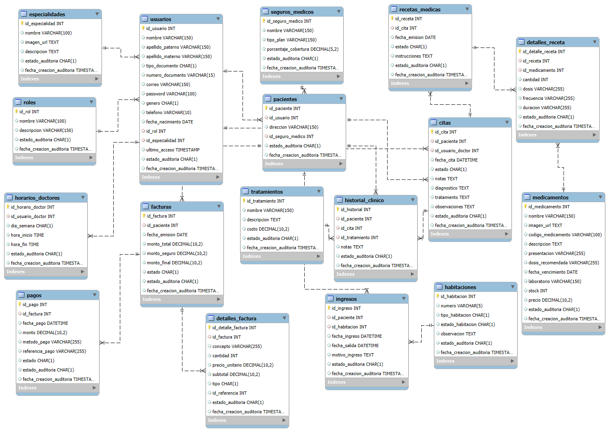

# Sistema web desarrollado 
## Para la administración  completa de las operaciones de un hospital desde el panel de administrador. Esta aplicación permite gestionar pacientes, citas médicas, personal médico e historias clínicas y también desde el portal para el cliente haga su reserva de manera integra y eficiente.

## Diagrama de la Base de Datos



## Tecnologías Utilizadas
- **Backend:** Laravel 12
- **Frontend:** Bootstrap 5
- **Base de Datos:** MySQL/PostgreSQL
- **Dependencias:** Composer, NPM

## Requisitos del Sistema
- PHP 8.2 o superior
- Composer
- Node.js y NPM
- MySQL/PostgreSQL
- Servidor web (Apache/Nginx)

## Contribuyentes
- Antony Brahams Paredes Paulino
- Homero Percy Quispe Coaquira
- José Randy Rodrigo Choque
- Hilder Ivan Riofrio cortez

## Instalación

### 1. Clonar el repositorio
```bash
git clone https://github.com/BrahamsCode/grupo7-webhospital.git
cd grupo7-webhospital
```

### 2. Instalar dependencias de PHP
```bash
composer install
```

### 3. Instalar dependencias de JavaScript
```bash
npm install
npm run dev
```

### 4. Configurar el entorno
```bash
cp .env.example .env
php artisan key:generate
```

### 5. Configurar la base de datos
Edita el archivo `.env` con la configuración de tu base de datos:
```
DB_CONNECTION=mysql
DB_HOST=127.0.0.1
DB_PORT=3306
DB_DATABASE=hospital_db
DB_USERNAME=root
DB_PASSWORD=
```

### 6. Migrar la base de datos
```bash
php artisan migrate --seed
```

### 7. Iniciar el servidor
```bash
php artisan serve
```
Accede a la aplicación en: http://localhost:8000

## Características y Módulos

### Módulo de Gestión de Pacientes
- Registro de nuevos pacientes
- Búsqueda y filtrado avanzado
- Visualización de datos personales
- Edición y actualización de información
- Gestión de documentos asociados

### Módulo de Citas Médicas
- Programación de nuevas citas
- Vista de calendario de citas
- Modificación y reprogramación
- Cancelación de citas
- Notificaciones y recordatorios

### Módulo de Gestión de Médicos
- Registro de personal médico
- Asignación de especialidades
- Configuración de horarios de atención
- Asignación de pacientes
- Gestión de disponibilidad

### Módulo de Historia Clínica
- Registro de consultas médicas
- Historial de tratamientos
- Registro de medicamentos prescritos
- Gestión de exámenes y resultados
- Reportes y estadísticas


## Uso del Sistema

### Acceso al Panel de Administración
1. Iniciar sesión con credenciales de administrador
   - Usuario: admin@hospital.com
   - Contraseña: admin123

### Flujo de Trabajo Básico
1. Registrar médicos y configurar horarios
2. Registrar pacientes en el sistema
3. Programar citas médicas asociando pacientes y médicos
4. Registrar consultas y actualizar historias clínicas

## Seguridad
- Autenticación basada en roles (administrador, recepcionista, médico)
- Protección CSRF en todos los formularios
- Encriptación de datos sensibles
- Validación de entradas en el cliente y servidor


## Licencia
Este proyecto está licenciado bajo [MIT License](LICENSE).

